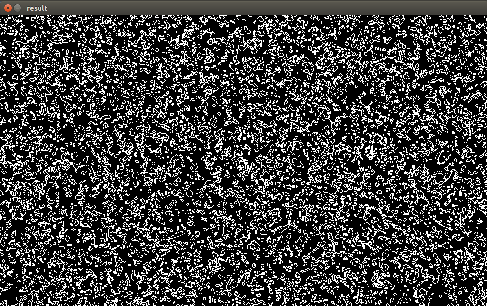

# Game of Life

###Description
C++ implementation of the [Conway's Game of Life](https://en.wikipedia.org/wiki/Conway%27s_Game_of_Life)

##Usage
<b>Usage:</B> ./game_of_life [options]

| Option | Description |
|:------:|:-----------:|
| --width <u>NUM</u> | width of the matrix |
| --height <u>NUM</u> | height of the matrix |
| --input <u>FILE</u> | file where to retrieve the matrix |
| --steps <u>NUM</u> | number of steps |
| --thread <u>NUM</u> | number of threads |
| --graphic | activate the graphic mode |
| --output <u>FILE</u> | file where to save the generated video |
| --help | shows this help view |


###Compile
If you have installed <b>cmake</b>, you can simple give the following commands:

```bash
mkdir build
cmake ..
make
```

Otherwise, you can use the <b>makefile</b> I wrote:
```bash
mkdir build
make
```

Bellow you can see a frame of the generated video giving to the program the following parameters:

```bash
./game_of_life -g -w 500 -h 300 -s 10
```



###License
The MIT License (MIT)

Copyright (c) 2015 Federico Conte

http://opensource.org/licenses/MIT
