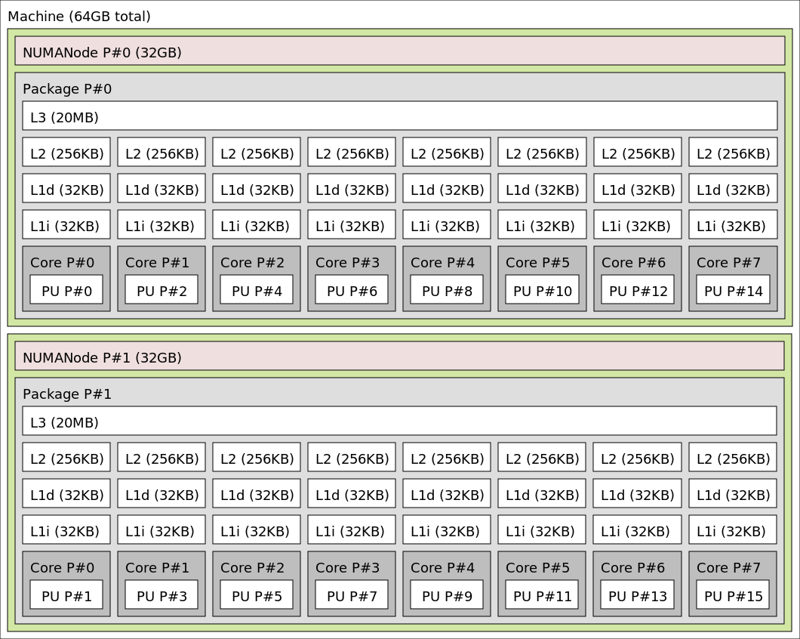

# Game of Life

###Description
C++ implementation of the [Conway's Game of Life](https://en.wikipedia.org/wiki/Conway%27s_Game_of_Life)

- In the [graphical_version](./graphical_version) folder, you can find my first implementation of GOL which use **opencv** in order to visualize all the steps of the grid of square cells.

- In the [xeon_version](./xeon_version) folder, you can find the implementations that I wrote having as target the following platform:
	**Hardware:** x86 64 architecture with Intel Xeon CPU E5-2650 @ 2.0GHz, 2 NUMA nodes with 8 cores each, 20MB L3 cache and 64GB of RAM equipped with Intel Xeon Phi™ coprocessor ( see image below )

	**Operating System** Red Hat Enterprise Linux Server release 6.5

	**Compiler:**  Intel C++ Compiler, Version 15.0.2

	

###License
Apache License

Copyright (c) 2015 Federico Conte

http://www.apache.org/licenses/LICENSE-2.0
