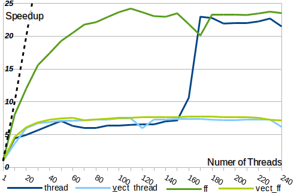

# Game of Life

###Description
C++ implementation of the [Conway's Game of Life](https://en.wikipedia.org/wiki/Conway%27s_Game_of_Life)

If this *README* is not enough and you want to have more details on the application, you can read the [report](./report.pdf).

###Development Methodologies

1. ***"thread"*** ➜ parallelization using low level threading mechanisms 
2. ***"vect_thread"*** ➜ parallelization using low level threading mechanisms plus **explicit vectorization** using [array notation and elemental function](https://software.intel.com/sites/default/files/managed/f0/24/4.1-cilkplus-vectorization.pdf)
3. ***"ff"*** ➜ parallelization using the [FastFlow framework](http://calvados.di.unipi.it/)
4. ***"vect_ff"*** ➜ parallelization using the FastFlow framework plus explicit vectorization

###Preview Results
These graphs shows the **speedup** achived respectivelly on Xeon Host and Xeon Phi for all the four development methodologies described above, where the grid size is **100 millions** of cells and the number of iterations is **100**.




###Compile
After you have cloned the project, to compile the program you'll need to use the following command lines:
```bash
cd GameOfLife/xeon_version/
mkdir build
make
```
Makefile **requires** the usage of Intel proprietary compiler **icpc** and **vectorization support**, besides the variable `$FF_ROOT` has to be properly configured:

```bash
# Pointing to the FastFlow root directory ( i.e. the one containing the ff directory ).
FF_ROOT = /home/spm1501/public/fastflow
```

It compile both
the parallel methodologies: *“GOL_thread”* and *“GOL_ff”* used in the application. Besides, this Makefile can be
configured setting the following control variables:

* **MIC:** if set to true, it compiles the application for Xeon Phi, else for Xeon Host ( default
false ).
* **DEBUG:** if set to true, activate the “debug mode” of the application, showing the evolution
of the Grid ( only if is a small one ) and checking the correctness of the result comparing
it with an easier, sequential and more trustful GOL implementation ( default false ).
* **MACHINE_TIME:** if set to true, shows the time values in microseconds, otherwise it shows
them in a more understandable format ( default true ).

For example, you can compile as following:
```bash
make MIC=true MACHINE_TIME=true
```


###Usage

The two executables can be found in the [build](./build) folder; in order to execute them, you can just
invoking them on Xeon Host, while on Xeon Phi they must first be copied to **mic**.

For example, you can execute the following:

```bash
scp build/GOL_thread build/GOL_ff mic1:
ssh mic1 ./GOL_thread --width 5000 --height 5000 --thread 240
ssh mic1 ./GOL_ff --width 5000 --height 5000 --thread 240
```

**Usage:** build/GOL_thread [options]

| Option | Description |
|:------:|:-----------|
| --vect | activate the vectorization version |
| --grain __NUM__ | chunk size assigned to threads <br /> ( zero for static scheduling ) |
| --width __NUM__ | grid width |
| --height __NUM__ | grid height |
| --seed __NUM__ | seed used to initialize the grid <br />( zero for timestamp seed ) |
| --iterations __NUM__| number of iterations to perform |
| --thread __NUM__ | number of threads ( zero for the sequential version ) |
| --help | shows all the options that can be set in the application |


###License
Apache License

Copyright (c) 2015 Federico Conte

http://www.apache.org/licenses/LICENSE-2.0
